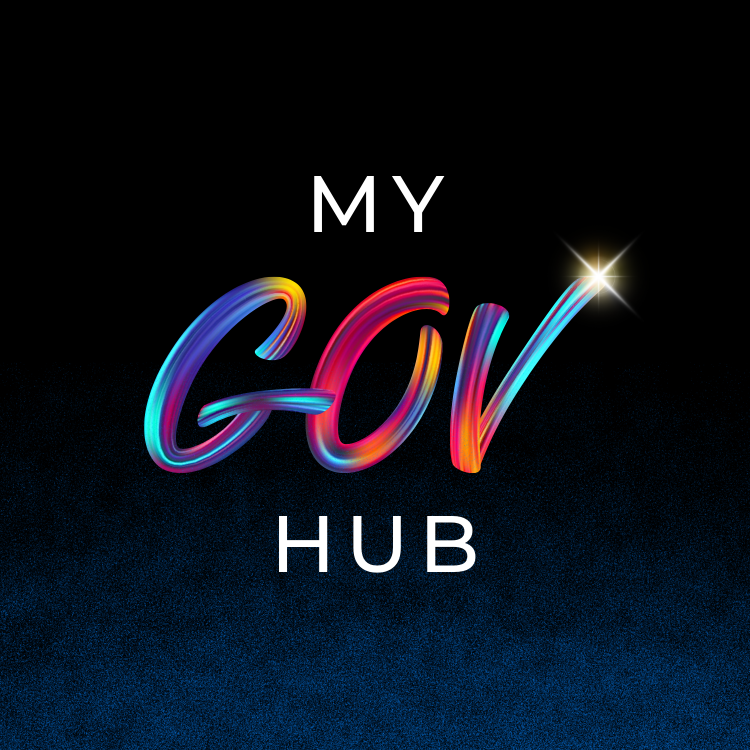
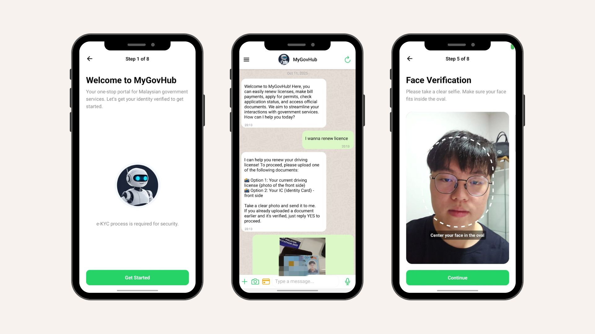
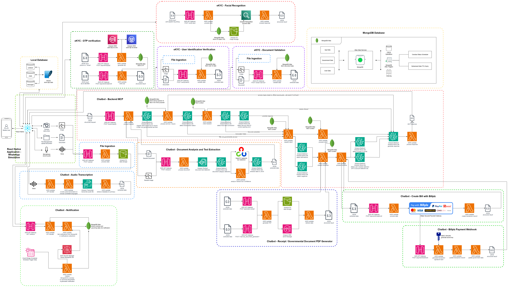
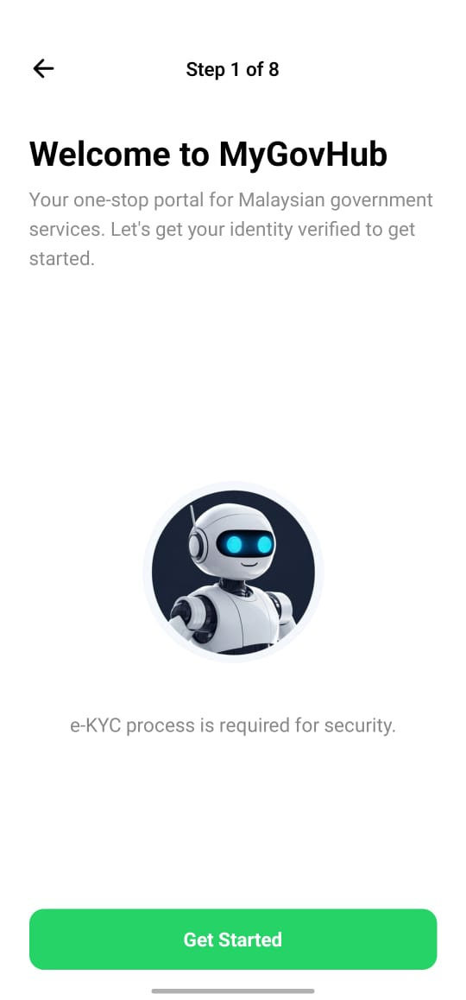
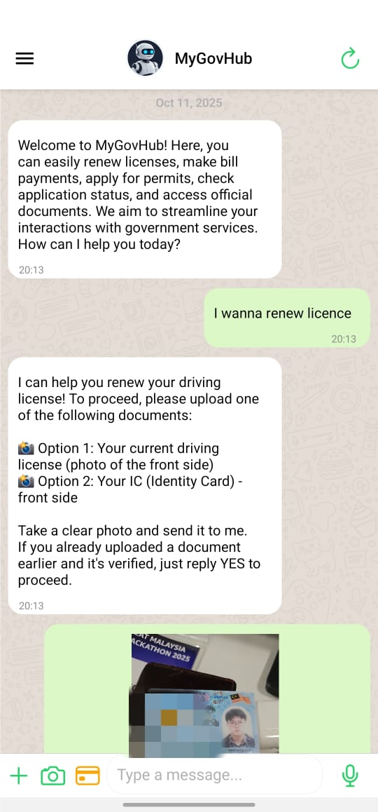
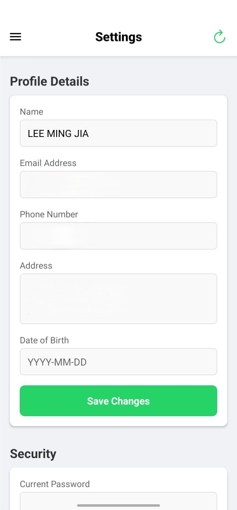
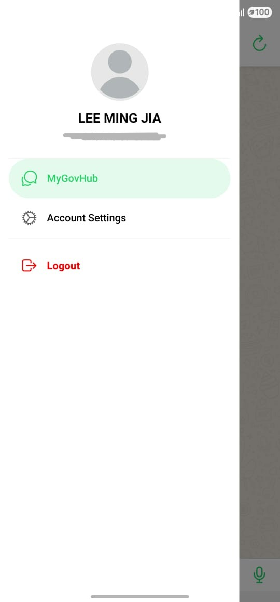

# MyGov Hub

## 📘 Project Overview

**MyGov Hub** is an AI-powered government assistant designed to unify fragmented online services into one secure, conversational platform. Instead of juggling multiple apps and websites, citizens can renew licenses, pay utility bills, check summons, or even snap a photo of a document, all within a single hub. With support for both text and voice, MyGov Hub makes public services as easy as chatting with an officer.

© 2025 Goodbye World team, for Great AI Hackathon Malaysia 2025 usage.

## 🚨 Problem Statement

Malaysia’s digital government ecosystem is highly fragmented, with nearly 300 different government apps and portals handling various functions. This creates three major challenges:

- **Confusion & Wasted Time**\
Citizens struggle with multiple apps and inconsistent designs, making services inconvenient and difficult to use.

- **Poor User Experience**\
Apps often freeze, fail at critical steps (e.g., OTP verification), and exclude seniors and less tech-savvy users.

- **High Operational Costs**\
Maintaining hundreds of separate platforms is expensive and inefficient for agencies.

Real voices and media reports confirm this problem, citizens complaining about app failures on Reddit, and The Sun reporting how duplication of nearly 300 apps has eroded trust.

## 🗺️ Architectural Diagram
<!--  -->

## ⚙️ Technical Architecture

MyGovHub’s architecture is a multi-layered, serverless ecosystem designed to process eKYC verification, document analysis, and conversational workflows through a unified government chatbot interface.

It leverages AWS cloud services, MongoDB Atlas, and a React Native frontend, ensuring scalability, fault tolerance, and modularity across all major functional domains.

The architecture is organized into four layers:
1. Layer I - Frontend (User Interaction),
2. Layer II - Backend MCP (Middleware & Application Logic),
3. Layer III - Backend Services (Specialized Microservices), and
4. Layer IV - Database (Data Storage).

### Layer I - Frontend (User Interaction)

The React Native application serves as the main entry point for users. It mimics a WhatsApp-style conversational interface, integrating text, image, and voice interactions.

This layer is responsible for capturing user input and displaying responses. It includes:

1. **Mobile Application (React Native + Expo):**
    - Provides voice and text input for communication with the chatbot.
    - Integrates a local SQLite database to temporarily cache session data and uploaded media.
    - Uses Axios-based REST API calls to communicate securely with the Backend MCP layer via HTTPS endpoints.
    - Handles user registration, eKYC onboarding, and payment confirmations.
    - Implements OTP verification and facial recognition steps during identity registration.

2. **eKYC Onboarding Flow:**
    - Users capture a selfie and upload their identity documents (e.g., IC, passport).
    - The app sends these images to the eKYC Backend API, uploading to AWS S3 via signed URLs for verification.
    - Triggers document validation and text extraction service through an API call.
    - Integrates with the OTP Verification API to confirm user identity.
    - Integrates with the Face Recognition API to verify selfie against ID photo.
    - Upon successful verification, user data is stored in the MongoDB database.

3. **Chatbot Interface:**
    - Users interact with the chatbot to request services, upload documents, and receive responses.
    - Supports multimodal input (text, image, voice, and file upload) and output (text, image, links, and files).
    - Captures user input and sends it to the Backend MCP layer via REST API calls.
    - Displays responses received from the Backend MCP layer.
    - Integrates notification service for reminders, transaction alerts, and OTP messages.

### Layer II - Backend MCP (Middleware & Application Logic)
The Backend MCP (MyGov Central Processor) orchestrates all API calls, workflow logic, and integration between the frontend and backend microservices.

It is built entirely on Amazon Bedrock, AWS Lambda functions, API Gateway, and MongoDB Atlas triggers for event-driven workflows.

- **Core Responsibilities:**
    - Manage session state, route API requests, and invoke appropriate Lambda functions.
    - Handle message processing, LLM integration, and response generation for chat sessions.
    - Bridge communication between frontend (React Native app) and backend microservices.
    - Amazon Bedrock is used for LLM inference and response generation.

- **Key Components:**
    - Amazon Bedrock: Provide comprehensive, secure and flexible access to leading foundation models to build generative AI app and agent. It powers the conversational AI, handling intent recognition, response generation, and context management.
    - AWS Lambda: Execute backend business logic, including API integrations, database operations, and workflow orchestration.
    - MongoDB Atlas Triggers: Execute Lambda functions in response to database events, such as checking status for government services and payment confirmations.

- **Conversation Management:**
    - The MCP maintains a session state for each user, tracking conversation history and context. This ensures coherent, multi-turn conversations.
    - Each session is uniquely identified via `session_id`.
    - Conversation context is stored in MongoDB (short-term) and fetched on each request.
    - AI responses are generated via AWS Bedrock LLM API, processed, and sent back to the app.

### Layer III - Backend Services (Specialized Microservices)

This layer consists of specialized microservices that handle distinct functionalities, including eKYC verification, document processing, speech-to-text conversion, payment processing, and notification services.

1. **eKYC Services:**
    - OTP Verification:
        - Dual-channel (SMS/Email) OTP delivery via AWS SNS and SES.
        - OTP stored in MongoDB with 5-minute expiry.
    - Facial Recognition:
        - Compares selfie from S3 with ID photo using AWS Rekognition.
        - Returns similarity score and verification decision.
    - Document Validation:
        - Uses AWS Textract for OCR text extraction.
        - Validates extracted text against government templates (e.g., license number, NRIC format).

2. **Chabot Services:**
    - Audio Transcription Service:
        - Uses AWS Transcribe to convert user speech to text.
        - Text is passed to the LLM agent for natural language understanding.
    - Document Analysis and Text Extraction:
        - AWS Textract → AWS Lambda parsing → MongoDB Vstore.
        - Extracted text is summarized or verified through the MCP and displayed to user.
    - Receipt and PDF Generator:
        - AWS Lambda compiles templates and stores PDFs in S3.
        - URLs are shared in chat for download or verification.
    - Notification Service:
        - Scheduled AWS EventBridge + Lambda send reminders (due bills, expiry dates).
        - Notifications are stored in MongoDB and pushed to frontend.

3. **Payment Services:**
    - Bill Creation (Billplz Integration):
        - Lambda creates bills through Billplz API with metadata (amount, user ID, service type).
        - Frontend receives the payment URL and opens in WebView.
    - Payment Webhook Handling:
        - Billplz sends callback → AWS Lambda verifies payment → MongoDB updates transaction status.
        - Trigger receipt generation via PDF service.

### Layer IV - Database (Data Storage)

All data persistence is managed by MongoDB Atlas, providing a fully managed NoSQL environment with auto-scaling and TTL-based cleanup.

- Store **governmental user profiles**, conversation history, payment transactions, and other metadata.
- **Data Lifecycle Management:**
    - Atlas Triggers automate periodic cleanup (e.g., delete expired OTPs).
    - TTL Indexes ensure transient data (chat sessions, OTPs) auto-expire after 7 days.
    - Scheduled Aggregations perform data normalization for reporting dashboards.
- **Integration Points:**
    - MongoDB Realm Triggers → AWS Lambda (event-driven updates)
    - Backend MCP fetches and updates documents via Atlas Data API
    - Indexed searches accelerate eKYC lookups and document matching.

## 🌟 Novelty

### User Experience

- **Conversational AI**\
Understands typos, slang, and informal language, no rigid menus.

- **Smart Q&A**\
Not just executing tasks, but also answering questions like an officer.

- **OCR + GenAI**\
Snap a bill or document, and the system knows what action to take.

- **Multilingual Speech-to-Text**\
Supports English, Chinese, and Malay for inclusivity.

- **Smart Session Handling**\
Idle chats auto-expire after 15 minutes, preventing frustration.

### Privacy & Security

- **eKYC Verification**\
Face match with government IC for trusted identity.

- **Data Protection**\
Chat history auto-deleted after 7 days.

- **Single Device Login**\
One active session at a time to prevent hijacking.

- **Bank-Grade Security**\
HMAC SHA-256 signatures secure every payment transaction.

## 🚀 Commercialization

**MyGov Hub** follows a Hybrid SaaS Model for government agencies and GLCs:

- **Subscription Fees**\
Predictable recurring revenue.

- **Pay-per-Use**\
Scalable costs aligned with actual adoption.

- **Integration Setup**\
    One-time onboarding fee per agency.\
    Why agencies pay:
    - Cheaper than building new apps.
    - Lower maintenance and upgrade costs.

- **Scalability**\
Start with high-demand services (JPJ renewals, TNB bills), expand to more agencies, and eventually offer an API marketplace for banks, insurance, and third-party services.

## 🌟 Impact
- **For Citizens**\
Save time, less confusion, better accessibility.
- **For Agencies**\
Lower costs, easier upgrades, higher efficiency.
- **For Nation**\
Stronger digital governance, aligned with Malaysia’s digital-first vision and SDGs.

## 📱 MyGovHub Interface Overview
<table style="border-collapse: collapse; border: none;">
  <tr>
    <td align="center" style="border: none;">
       
      <b>Welcome Page</b>
    </td>
    <td align="center" style="border: none;">
       
      <b>Chatbot Conversation</b>
    </td>
    <td align="center" style="border: none;">
       
      <b>Settings Page</b>
    </td>
    <td align="center" style="border: none;">
       
      <b>Size Bar</b>
    </td>
  </tr>
</table>

## 🧩 Systems and Repositories
| NO.| System | Description |
| ----------- | ----------- |----------- |
| 1 | [GMAiH Chatbot - MyGovHub AI Assistant](https://github.com/MyGovHub-Goodbye-World/GMAiH-ChatBot-Frontend) | A React Native chatbot application built with Expo for the Great Malaysia AI Hackathon. This WhatsApp-style chat interface connects users with MyGovHub's AI-powered government services assistant. |
| 2 | [Backend Agent MCP](https://github.com/MyGovHub-Goodbye-World/backend-agent-mcp) | A serverless AWS Lambda function providing AI-powered government service assistance for MyGovHub, handling license renewal and TNB bill payments. |
| 3 | [eKYC Backend API Documentation](https://github.com/MyGovHub-Goodbye-World/ekyc-backend) | A serverless backend API for eKYC document verification using OCR and database matching, powered by AWS Lambda and Python. |
| 4 | [Document Ingestion and Text Extraction Service](https://github.com/MyGovHub-Goodbye-World/document-ingestion-and-text-extraction) | A comprehensive document analysis tool that combines AWS Textract, Bedrock, and intelligent blur detection. Available as both CLI and serverless Lambda API. |
| 5 | [OTP Verification API](https://github.com/MyGovHub-Goodbye-World/otp-verification-api) | A serverless API providing a complete solution for sending and verifying one-time passwords (OTPs) via both SMS and email. It is built to be deployed on AWS and leverages AWS Lambda, API Gateway, SNS for SMS, and SES for email notifications. OTP records are stored and managed in a MongoDB database.|
| 6 | [Face Recognition API](https://github.com/MyGovHub-Goodbye-World/face-rekon-api) | A Serverless API providing a complete AWS-based solution for comparing faces and analyzing selfie image quality using Amazon Rekognition. It is designed to help verify user identity by comparing a selfie photo with an ID card image stored in Amazon S3.|
| 7 | [Notification Service](https://github.com/MyGovHub-Goodbye-World/notification-greatai) | AWS Lambda function which fetches data from MongoDB, notifying MyGovHub users about upcoming & overdue bill payments or documentation renewal reminders. Setup includes 2 seperate AWS Lambda functions.|
| 8 | [S3 Upload API Service](https://github.com/MyGovHub-Goodbye-World/s3-api) | A serverless file upload service built with AWS Lambda, API Gateway, and S3. This service allows you to upload files to S3 and get pre-signed download URLs. |
| 9 | [AWS Transcribe API Service](https://github.com/MyGovHub-Goodbye-World/transcribe-api) | A serverless AWS Lambda function that provides multi-language audio/video transcription services using AWS Transcribe. This service supports English, Chinese, Malay, and Indonesian languages and accepts S3 URLs for audio/video files. |
| 10 | [PDF Receipt Generator API](https://github.com/MyGovHub-Goodbye-World/transcribe-api) | A serverless AWS Lambda function that generates PDF receipts for TNB bills, driving licenses, and transactions. The API processes JSON data and returns secure, time-limited download URLs for generated PDF receipts. |
| 11 | [Billplz Payment Service API](https://github.com/MyGovHub-Goodbye-World/billplz-payment-api) | Serverless payment service for MyGovHub that integrates with the Billplz payment gateway and MongoDB for transaction management. |
| 12 | [MongoDB Database Setup Guide](https://github.com/MyGovHub-Goodbye-World/mygovhub-mongodb) | This guide helps you set up and import multiple MongoDB databases for the Great AI Hackathon project. The setup includes 5 separate databases with Malaysian government service data.

## 📊 Summary

**MyGov Hub** redefines how citizens interact with the government by turning dozens of disjointed apps into a single AI-powered experience.

*"One Hub, All Services"*

It’s simple, scalable, and human-friendly, designed to:

- 💡 Save citizens time
- 💰 Reduce government expenses
- 🌐 Accelerate digital-first adoption

## 👥 Project Team

**MyGov Hub** is the result of a dedicated, multidisciplinary team, each member bringing unique expertise to deliver a seamless and innovative platform:

| Name | Role | Key Contributions |
|------|------|-------------------|
| [Lee Ming Jia](https://github.com/mjlee01) | Team Lead / UI & UX | Led frontend development and UI/UX design. Built the Billplz payment gateway (AWS Lambda) and designed the entire application interface. |
| [Lim Wen Hao](https://github.com/WenHao1223) | Tech Lead / AI Specialist | Architected backend and AI integration. Developed the core conversational chatbot platform using AWS Bedrock, AWS Textract, AWS Lambda, and MongoDB. |
| [Tan Jun Cheng](https://github.com/Jccc03) | Business Strategy Lead | Crafted and presented the business case, ensuring a compelling narrative and clear value proposition. |
| [Lim Kang Wei](https://github.com/lk-wei) | eKYC Specialist | Developed eKYC microservices, including OTP validation, face recognition, and document verification for robust user authentication. |
| [Ivan Soo Chee Yang](https://github.com/ivan-soo) | Core Services Specialist | Engineered core business logic, including the Report Generation API and a comprehensive Notification API (SMS, Email, In-App). |
